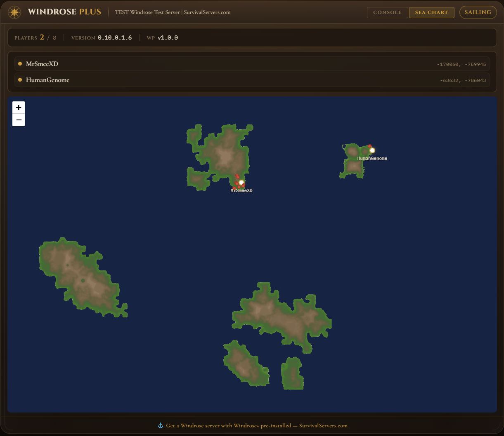

# Windrose+

[](LICENSE)
[](https://github.com/UE4SS-RE/RE-UE4SS)
[](https://store.steampowered.com/app/3041230/)
[](#)

Everything your Windrose dedicated server is missing. Multipliers, a live map, an admin console, server browser support, and mod support. Server-side only, no client mods required.

> **Recommended Hosting** - Get a Windrose server with Windrose+ pre-installed at [SurvivalServers.com](https://www.survivalservers.com/services/game_servers/windrose/?utm_source=github&utm_medium=readme&utm_campaign=windrose_plus)

_Windrose+ is a community project and is not affiliated with or endorsed by the developers of Windrose._

---

## Table of Contents

- [Features](#features)
- [Installation](#installation)
- [Using Windrose+](#using-windrose)
- [Integrations](#integrations)
- [Contributing](#contributing)
- [License](#license)

---

## Features

### Live Sea Chart
A real-time map of your server showing player positions, creature locations, and island terrain, right in your browser. The map generates automatically when the first player connects.



### Admin Console (RCON)
Run commands from a web dashboard with autocomplete. Check who's online, view server stats, monitor performance, and manage your server remotely. 30 built-in commands out of the box.


### Server Query
Windrose dedicated servers don't respond to standard server queries, so your server won't show player counts or status to external tools. Windrose+ adds a query responder so server browsers and monitoring tools can see your server.

```json
{
  "server": {
    "name": "My Windrose Server",
    "version": "0.10.0.1.6",
    "windrose_plus": "1.0.13",
    "password_protected": false,
    "max_players": 10,
    "player_count": 3
  },
  "players": [
    { "name": "HumanGenome", "alive": true, "x": 14520, "y": -8340 },
    { "name": "CaptainMorgan", "alive": true, "x": 6200, "y": 1100 }
  ],
  "multipliers": {
    "xp": 3.0, "loot": 2.0, "stack_size": 5.0,
    "craft_cost": 0.5, "crop_speed": 2.0, "weight": 5.0
  }
}
```

### 2,400+ Server Settings & Multipliers
Adjust XP, loot, crafting costs, crop speed, cooking/smelting speed, harvest yield, inventory size, carry weight, and more through a simple JSON file. Go deeper with 2,400+ individual INI settings for player stats, weapons, food effects, creature stats, co-op scaling, swimming, and rest bonuses.

> **Note on `stack_size` and `points_per_level`:** `stack_size` patches the server PAK but has no effect on vanilla clients — `MaxCountInSlot` is enforced client-side, so the knob only works if every connected client loads a matching PAK ([#17](https://github.com/HumanGenome/WindrosePlus/issues/17)). `points_per_level` is disabled as of v1.0.8 because it crashes the server on character login ([#20](https://github.com/HumanGenome/WindrosePlus/issues/20)); use `wp.givestats` instead to grant extra points.

> **Save-safety warning:** `inventory_size`, `stack_size`, `weight`, and other inventory-affecting PAK edits can become part of player save state once a character logs in and saves. Take an out-of-band save backup before enabling them, and do not combine Windrose+ PAK overrides with other PAK mods that edit the same inventory/stack assets unless you are ready to restore from backup.

**Multipliers** (`windrose_plus.json`):
```json
{
  "xp": 3.0,
  "loot": 2.0,
  "stack_size": 5.0,
  "craft_cost": 0.5,
  "crop_speed": 2.0,
  "cooking_speed": 2.0,
  "harvest_yield": 2.0,
  "inventory_size": 2.0,
  "points_per_level": 2.0,
  "weight": 1.0
}
```

**Player Stats** (`windrose_plus.ini`):
```ini
[PlayerStats]
MaxHealth = 320
MaxStamina = 150
StaminaRegRate = 40
MaxPosture = 40
Armor = 0
MaxWeight = 99999
```

**Food Effects** (`windrose_plus.food.ini`):
```ini
[Food_Drink]
Food_Drink_Coffee_T03_Duration = 1800
Food_Drink_Coffee_T03_Endurance = 20
Food_Drink_Coffee_T03_MaxHealth = 160
Food_Drink_Coffee_T03_Mobility = 20

[Alchemy_Potions]
Alchemy_Potion_Healing_Base_HealthRestoreRatio = 0.35
Alchemy_Potion_Healing_Great_HealthRestoreRatio = 0.8
```

### Mod Support
Drop a Lua script into the `Mods/` folder and it loads automatically. Add custom commands, scheduled tasks, and player join/leave hooks. Changes hot-reload without restarting the server.

**For modders** — full API reference, manifest format, and examples are in [docs/scripting-guide.md](docs/scripting-guide.md). Admin command list: [docs/commands.md](docs/commands.md). Config keys: [docs/config-reference.md](docs/config-reference.md).

Ships with an example mod:

```lua
-- example-welcome/init.lua
local API = WindrosePlus.API

API.onPlayerJoin(function(player)
    API.log("info", "Welcome", player.name .. " joined the server")
end)

API.onPlayerLeave(function(player)
    API.log("info", "Welcome", player.name .. " left the server")
end)

API.registerCommand("wp.greet", function(args)
    local players = API.getPlayers()
    local names = {}
    for _, p in ipairs(players) do table.insert(names, p.name) end
    return "Ahoy, " .. table.concat(names, ", ") .. "!"
end, "Greet all online players")
```

External tools that don't run inside Lua can tail `windrose_plus_data/events.log` (line-delimited JSON, written on every player join/leave) for join/leave detection without polling.

### CPU Optimization
Optional idle CPU limiting for hosts that want to reduce CPU use when nobody is connected. The bundled `IdleCpuLimiter` C++ mod applies an idle-only Windows CPU cap after the server has finished booting, then restores the full CPU budget when Windrose+ sees an active player. Process affinity is left unchanged.

The limiter is disabled by default because Windrose can still report `player_count: 0` while a player is connecting, loading a character, or finishing the tutorial. Under a very low idle cap, that join path can time out before the player becomes visible to the status poller.

For public/self-hosted installs, opt in from `windrose_plus.json`:

```json
{
    "performance": {
        "idle_cpu_limiter_enabled": true,
        "idle_cpu_limit_percent": 2.0
    }
}
```

Then rerun `install.ps1` and restart the server so UE4SS loads `IdleCpuLimiter`.

To disable it again, set `idle_cpu_limiter_enabled` to `false`, rerun `install.ps1`, and restart. If the limiter is already loaded, the installer also writes a disabled marker so the cap is lifted on the next status check.

Use the default `2.0` percent unless you have a reason to tune it. Raise it if players report slow joins or loading timeouts; `10.0` means a 10% idle CPU cap.

```
[IdleCpuLimiter] applied idle CPU rate 200
[IdleCpuLimiter] lifted idle CPU rate 10000
```

---

## Installation

You need a Windrose Dedicated Server already set up on Windows. If you don't have one yet, you can [rent a server from SurvivalServers](https://www.survivalservers.com/services/game_servers/windrose/?utm_source=github&utm_medium=readme&utm_campaign=windrose_plus) (Windrose+ comes pre-installed) or [set one up yourself](https://www.survivalservers.com/wiki/index.php?title=How_to_Create_a_Windrose_Server_Guide).

### Step 1: Download and Install

1. Download the latest release from [GitHub Releases](https://github.com/HumanGenome/WindrosePlus/releases/latest).
2. Extract the zip into your Windrose Dedicated Server folder (e.g. `C:\WindroseServer\`).
3. Open PowerShell in that folder and run:

```powershell
.\install.ps1
```

This downloads UE4SS, installs the mod, and sets up the dashboard. Reinstalling is safe, your custom configs and mods are preserved.

### Step 2: Start Your Server

Edits to `multipliers` in `windrose_plus.json` or to any `.ini` file need to be baked into a game override PAK before the server launches — otherwise the game loads the unmodified defaults. That rebuild step is what `tools/WindrosePlus-BuildPak.ps1` does.

**The easy way:** run `StartWindrosePlusServer.bat` (installed at your server root). It runs the rebuild step if anything changed (no-op in milliseconds otherwise), then launches `WindroseServer.exe`.

**If you already have your own launcher**, add one line before whatever calls `WindroseServer.exe`:

```powershell
powershell -NoProfile -ExecutionPolicy Bypass -File "<gameDir>\windrose_plus\tools\WindrosePlus-BuildPak.ps1" -ServerDir "<gameDir>" -RemoveStalePak
```

Non-zero exit means the build failed — don't launch the game.

Windrose+ loads automatically either way.

> **Note:** You must **Run as Administrator** when starting the server. Windrose+ uses a proxy DLL (UE4SS) that requires elevated permissions to load.

To start the web dashboard, open a second terminal in your game server folder and run:

```powershell
windrose_plus\start_dashboard.bat
```

The dashboard URL and RCON password are shown in the console. On first run, a `windrose_plus.json` config file is created with defaults.

By default the dashboard listens on all interfaces when PowerShell is elevated, then falls back to localhost if Windows blocks the wildcard listener. Multi-IP hosts can bind it to one address:

```powershell
windrose_plus\start_dashboard.bat -BindIp 192.0.2.10
```

You can also set `"server": { "bind_ip": "192.0.2.10" }` in `windrose_plus.json`.

---

## Using Windrose+

### Configuring Your Server

Windrose+ has two config files:

- **`windrose_plus.json`** (basic): multipliers, RCON password, admin Steam IDs, feature flags. Created automatically on first launch. Edit this for everyday changes.
- **`windrose_plus.ini`** (advanced): player base stats, weapon damage, food effects, creature stats, talents, combat tuning. Optional — copy `windrose_plus\config\windrose_plus.default.ini` to `windrose_plus.ini` if you want to customize.

Example `windrose_plus.json`:

```json
{
    "multipliers": {
        "loot": 2.0,
        "xp": 3.0,
        "stack_size": 5.0
    },
    "rcon": {
        "enabled": true,
        "password": "your-password-here"
    },
    "server": {
        "http_port": 8780,
        "bind_ip": ""
    },
    "performance": {
        "idle_cpu_limiter_enabled": false,
        "idle_cpu_limit_percent": 2.0
    }
}
```

Multiplier and `.ini` edits need the override PAK rebuilt before the next launch — see [Step 2](#step-2-start-your-server) for the rebuild command (`StartWindrosePlusServer.bat` handles it for you). RCON password, admin IDs, and feature flags are read live and take effect without a rebuild.

See [docs/config-reference.md](docs/config-reference.md) for every advanced INI setting.

### Dashboard

Open the dashboard in your browser to manage your server. It includes a command console with autocomplete and a live Sea Chart showing player and mob positions in real-time.

### Commands

Type `wp.help` in the console to see all 30 available commands. Common ones:

| Command | What it does |
|---------|-------------|
| `wp.status` | Server info and active multipliers |
| `wp.players` | Who's online and where |
| `wp.config` | Current settings |
| `wp.creatures` | What's spawned on the map |
| `wp.memory` | Server memory usage |

Full reference: [docs/commands.md](docs/commands.md)

### Advanced: INI Settings

For fine-grained control beyond multipliers, Windrose+ supports 2,400+ individual settings across player stats, weapons, food, gear, and creatures.

Copy any `.default.ini` from the `config/` folder, rename it (drop `.default`), and edit only the values you want to change. Full reference: [docs/config-reference.md](docs/config-reference.md)

Type-specific files such as `windrose_plus.food.ini` and `windrose_plus.weapons.ini` can be used without creating a root `windrose_plus.ini`. `StartWindrosePlusServer.bat` includes those files in the rebuild hash, so edits trigger a new PAK build on the next launch.

### Mods

Windrose+ supports custom Lua mods. Drop a folder into `WindrosePlus/Mods/` with a `mod.json` and your script. It hot-reloads automatically.

See [docs/scripting-guide.md](docs/scripting-guide.md) for the API and examples.

---

<details>
<summary><strong>Troubleshooting</strong></summary>

- **Server crashes on startup** - Check `UE4SS-settings.ini`. Only `HookProcessInternal` and `HookEngineTick` should be enabled.
- **RCON not working** - Set a real password in `windrose_plus.json` (not blank, not `changeme`).
- **Dashboard commands time out except `wp.help`** - Fully stop the game process and dashboard, then start them again. If you launched with `StartWindrosePlusServer.bat`, closing the console window can leave `WindroseServer-Win64-Shipping.exe` running in the background; stop it in Task Manager before relaunching.
- **No map data** - A player needs to connect at least once to trigger terrain export.
- **Fully disable Windrose+ for recovery testing** - Stop the server, rename `R5\Binaries\Win64\dwmapi.dll`, delete or move `R5\Content\Paks\WindrosePlus_Multipliers_P.pak` and `R5\Content\Paks\WindrosePlus_CurveTables_P.pak`, then delete `R5\Content\Paks\.windroseplus_build.hash`. Removing settings from `windrose_plus.json` is not enough because UE4SS and existing PAK overrides can still load.
- **Recovering from inventory/stack save issues** - Restore a save backup from before the inventory-affecting PAK change, fully disable Windrose+ as above, then confirm the character can join before re-enabling any PAK overrides.

</details>

---

## Integrations

- [Windrose Server Manager](https://github.com/ManuelStaggl/WindroseServerManager) can install and manage Windrose+ from its Windows desktop UI. It fetches the latest Windrose+ release instead of bundling a stale copy.

---

## Contributing

See [CONTRIBUTING.md](CONTRIBUTING.md).

---

## Disclaimer

Windrose+ is a community project and is not affiliated with or endorsed by the developers of Windrose. Use at your own discretion and in accordance with the [Windrose EULA](https://playwindrose.com/eula/).

---

## License

MIT. See [LICENSE](LICENSE).

## Credits

- [UE4SS](https://github.com/UE4SS-RE/RE-UE4SS) - Unreal Engine scripting and modding framework
- [rxi/json.lua](https://github.com/rxi/json.lua) - Pure Lua JSON library (MIT)
- Server hosting by [SurvivalServers.com](https://www.survivalservers.com/services/game_servers/windrose/?utm_source=github&utm_medium=readme&utm_campaign=windrose_plus)
